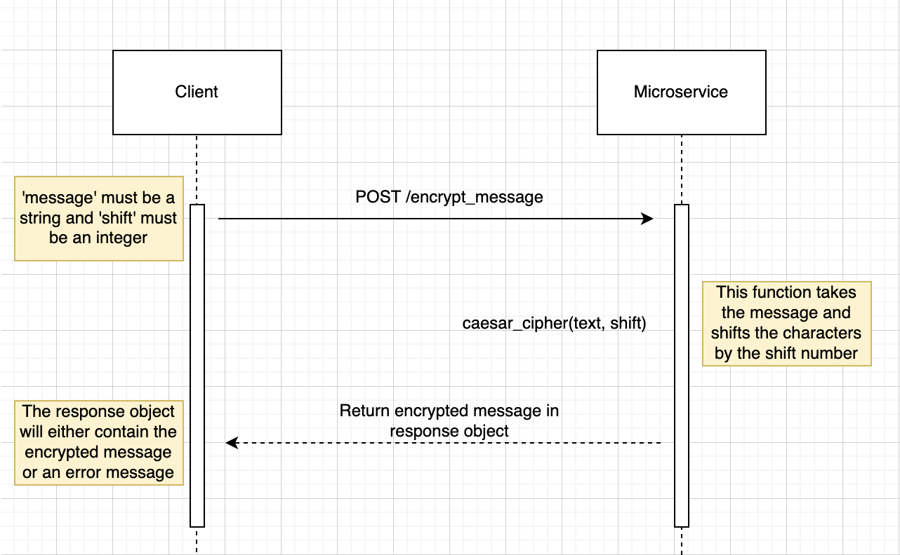

# Overview

This microservice encrypts a given message using a Caesar cipher with a specified shift value. It handles both positive and negative shifts and supports both alphabetic and non-alphabetic characters.

# How to Run the Microservice

## Install Dependencies

Ensure you have Flask installed. If not, you can install it using pip:

`pip install Flask`

## Run the Microservice

Run the Flask application:

`python microservice.py`

By default the service runs on port 5000.

# Requesting and Receiving Data

You can request data from the microservice by making an HTTP POST request to the /encrypt_message endpoint. The request should include a JSON body with the message to be encrypted and the shift value. Note: The message to by encrypted should be a string and the shift number should be a positive or negative integer.

```python
import requests
import json

url = 'http://localhost:5000/encrypt_message'
headers = {'Content-Type': 'application/json'}
data = {
    'message': 'Hello, World!',
    'shift': 5
}

response = requests.post(url, data=json.dumps(data), headers=headers)

if response.status_code == 200:
    result = response.json()
    print(f"Encrypted Message: {result['encrypted_message']}")
else:
    print(f"Error: {response.status_code}")
    print(response.json())

```

After making a request to the microservice, you will receive a JSON response containing the encrypted message or a response status code describing the error.

# UML Diagram




